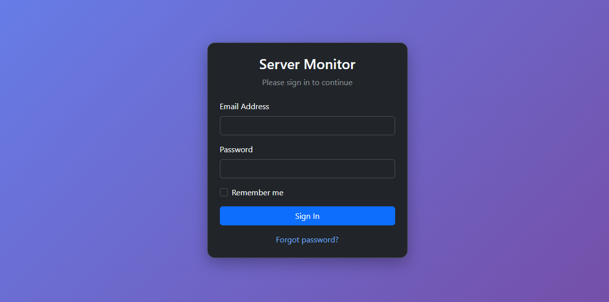
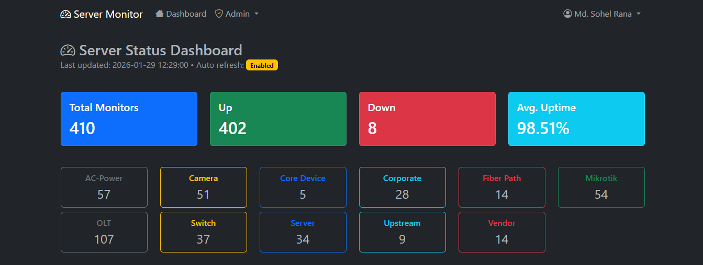
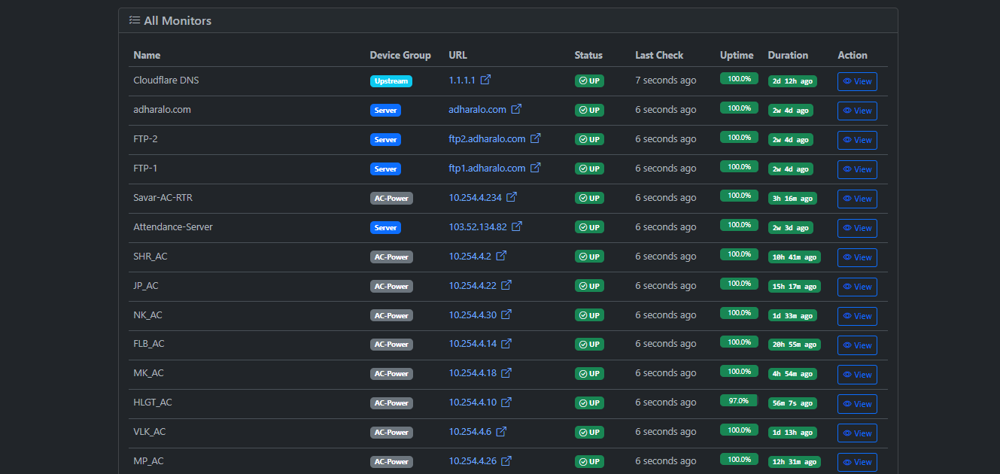
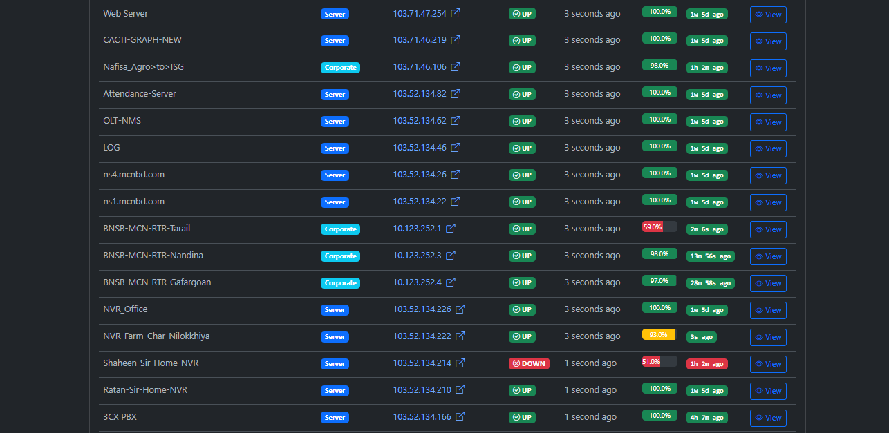

# 📊 Server Monitor & Network Status Dashboard

A modern, real-time **Server & Network Monitoring Dashboard** designed to monitor servers, routers, switches, cameras, OLTs, Mikrotik devices, upstream links, and power sources from a single unified interface.

This system provides **live status**, **uptime tracking**, **device grouping**, and **visual health indicators** to help network and system administrators quickly detect and resolve issues.

---

## 🚀 Features

- ✅ Real-time server & device status monitoring  
- 📈 Uptime & availability tracking  
- 🔄 Auto-refresh dashboard (enabled by default)  
- 🟢🟡🔴 Clear UP / DOWN visual indicators  
- 🗂️ Device grouping (Server, Corporate, OLT, Camera, AC Power, Mikrotik, etc.)
- 🌐 URL / IP based monitoring
- 👀 Detailed monitor view for each device
- 📊 Summary statistics dashboard
- 🌙 Dark mode friendly UI

---

## 🧩 Device Categories Supported

- **Servers**
- **Core Devices**
- **OLT**
- **Switch**
- **Mikrotik**
- **Corporate Links**
- **Fiber Paths**
- **Upstream Providers**
- **Cameras (NVR/IP Cam)**
- **AC Power / Power Routers**
- **Vendor Devices**

---

## 📌 Dashboard Overview

### 🔢 Overall Statistics
- **Total Monitors**
- **Total UP**
- **Total DOWN**
- **Average Uptime (%)**

### 📦 Device Count by Category
Each device group is displayed with a live count for quick assessment.

---

## 🖼️ Screenshots
### Login Panel


### Dashboard





### All Monitors View


### Detailed Monitor List


---

## 🛠️ Tech Stack

> *(Update this section if needed)*

- **Backend:** PHP / Laravel / Node.js *(as applicable)*
- **Frontend:** HTML, CSS, JavaScript, Bootstrap
- **Database:** MySQL / MariaDB
- **Monitoring:** Ping / HTTP / TCP checks
- **UI Theme:** Dark Admin Dashboard

---

## ⚙️ Installation

```bash
git clone https://github.com/yourusername/server-monitor-dashboard.git
cd server-monitor-dashboard
