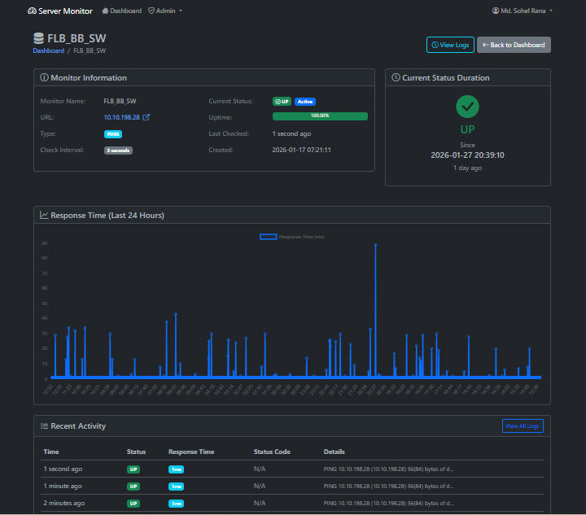
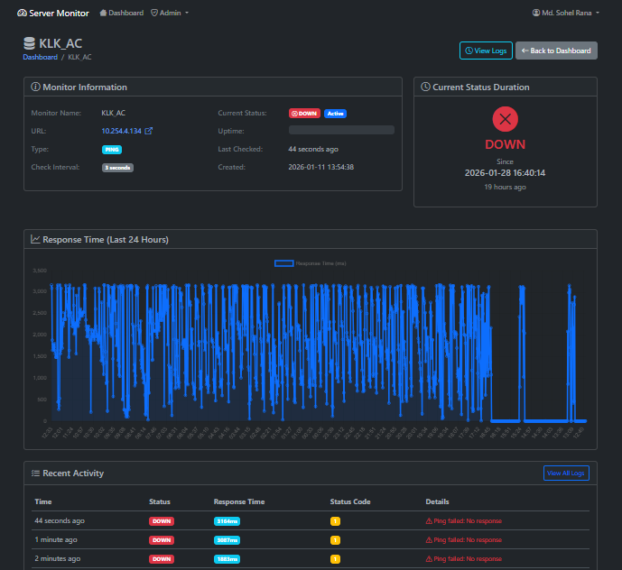
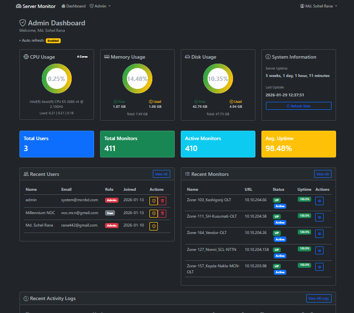
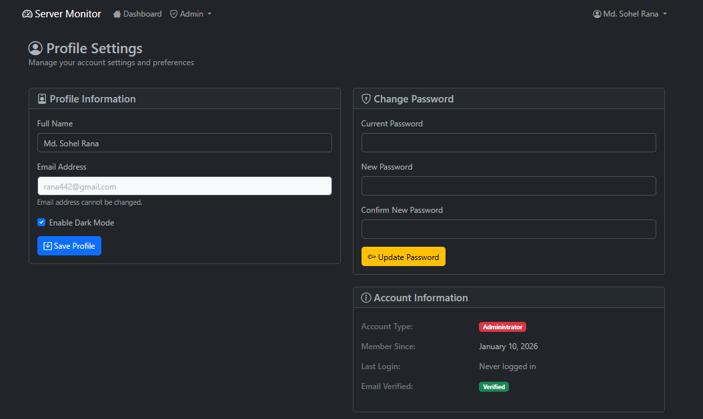
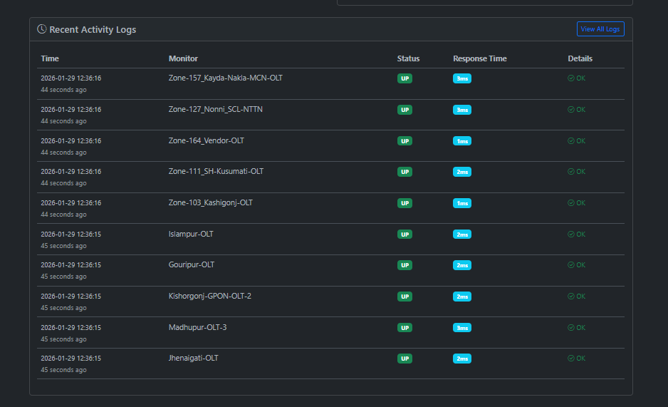
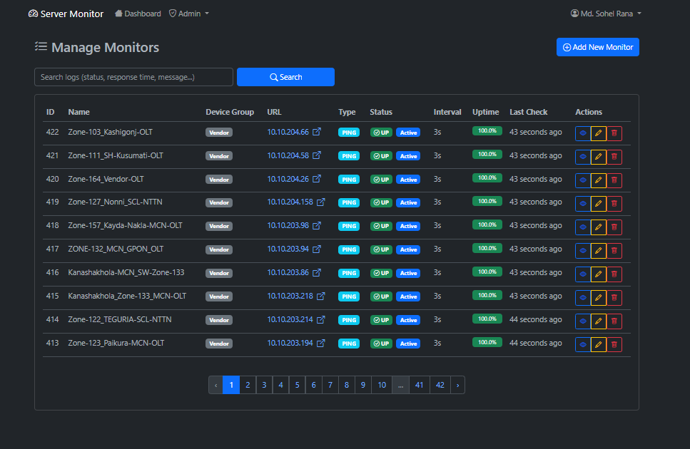
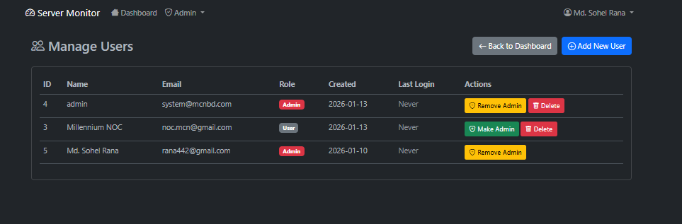

# 🚀 Server Monitor & Network Status Dashboard


A sleek, real-time **Server & Network Monitoring Dashboard** built for network administrators and IT teams. Monitor servers, routers, switches, cameras, OLTs, Mikrotik devices, upstream links, and power sources—all from a single, unified interface.

With **live status updates**, **uptime tracking**, and **visual health indicators**, you can detect and resolve issues faster, ensuring optimal network performance and reliability.

---

## ✨ Features

| Feature | Description |
|---------|-------------|
| ✅ **Real-Time Monitoring** | Live status checks for servers, devices, and network links. |
| 📈 **Uptime Tracking** | Continuous availability tracking with uptime percentage. |
| 🔄 **Auto-Refresh** | Dashboard updates automatically to reflect current status. |
| 🎨 **Visual Indicators** | Color-coded status (🟢 UP / 🟡 WARNING / 🔴 DOWN) for quick assessment. |
| 🗂️ **Device Grouping** | Organize devices by type: Servers, OLTs, Cameras, Switches, etc. |
| 🌐 **Multi-Protocol Checks** | Supports ping, HTTP, TCP, and custom port monitoring. |
| 📊 **Summary Dashboard** | Overview of total devices, uptime stats, and category-wise counts. |
| 🌙 **Dark-Mode UI** | Eye-friendly dark theme designed for extended use. |
| 🔐 **Secure Login** | Role-based access control for admins and viewers. |

---

## 📦 Supported Device Categories

| Category | Examples |
|----------|----------|
| **Servers** | Web servers, database servers, application servers |
| **Core Devices** | Core routers, core switches |
| **OLT** | Optical Line Terminals |
| **Switch** | Network switches (managed/unmanaged) |
| **Mikrotik** | MikroTik routers and devices |
| **Corporate Links** | VPN links, leased lines |
| **Fiber Paths** | Fiber-optic network paths |
| **Upstream Providers** | ISP upstream links |
| **Cameras** | IP cameras, NVR systems |
| **AC Power / Power Routers** | Power sources, UPS devices |
| **Vendor Devices** | Third-party hardware and appliances |

---

## 📸 Screenshots

### 🔐 Login Panel


### 📊 Dashboard Overview


### 🖥️ Devices Status View



### ⚙️ Admin Dashboard & Profile




### 👥 Device & User Management



> **Note:** All screenshots are standardized to 1280×720 resolution for consistent viewing.

---

## 🛠️ Tech Stack

| Layer | Technology |
|-------|------------|
| **Backend** | PHP, Laravel / Node.js (as applicable) |
| **Frontend** | HTML5, CSS3, JavaScript, Bootstrap 5 |
| **Database** | MySQL / MariaDB |
| **Monitoring Engine** | Custom ping/HTTP/TCP checks |
| **UI Theme** | Custom dark admin dashboard |
| **Charts/Graphs** | Chart.js or similar (if applicable) |

---

## ⚙️ Installation & Setup

### Prerequisites
- Web server (Apache/Nginx)
- PHP 7.4+ or Node.js (depending on backend)
- MySQL/MariaDB
- Git

### Steps
```bash
# Clone the repository
git clone https://github.com/yourusername/server-monitor-dashboard.git
cd server-monitor-dashboard

# Install backend dependencies (if Laravel)
composer install

# Or if Node.js
npm install

# Configure environment
cp .env.example .env
# Edit .env with your database and monitoring settings

# Generate application key (Laravel)
php artisan key:generate

# Run database migrations
php artisan migrate

# Seed initial data (if needed)
php artisan db:seed

# Start the application
php artisan serve
# Or for Node.js: npm start